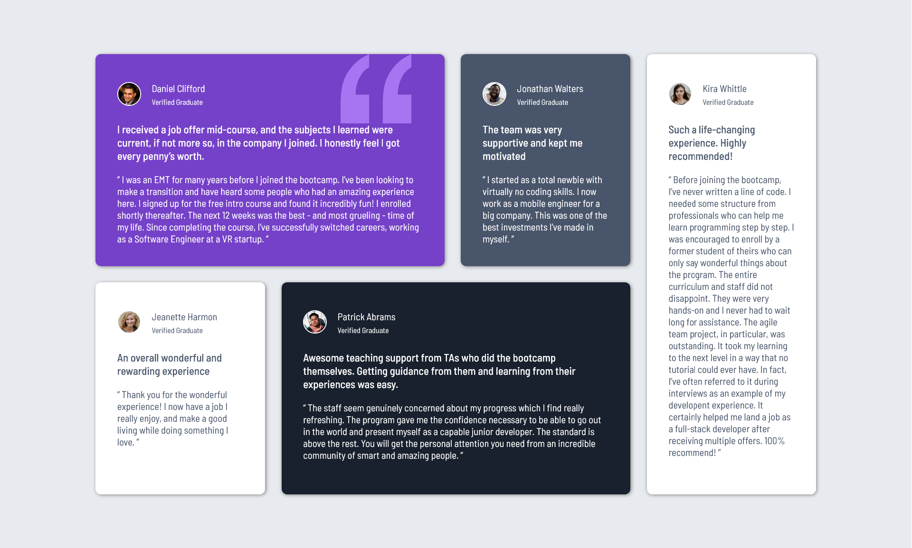

# Frontend Mentor - Testimonials grid section solution

This is a solution to the [Testimonials grid section challenge on Frontend Mentor](https://www.frontendmentor.io/challenges/testimonials-grid-section-Nnw6J7Un7). Frontend Mentor challenges help you improve your coding skills by building realistic projects. 

## Overview

### Screenshot

### Links

- Solution URL: [Github Link](https://github.com/siyam-eng/testimonials-grid-section.git)
- Live Site URL: [Live site](https://siyam-eng.github.io/testimonials-grid-section)

## My process

### Built with

- Semantic HTML5 markup
- CSS custom properties
- CSS Grid, Flexbox

### What I learned
Learned to use CSS grid to make custom 2D layouts. 
## Author

- Website - [Siyam Ahmed](https://siyamahmed.com)
- Frontend Mentor - [@Siyam1888](https://www.frontendmentor.io/profile/Siyam1888)
- Twitter - [@siyam_88](https://www.twitter.com/siyam_88)
